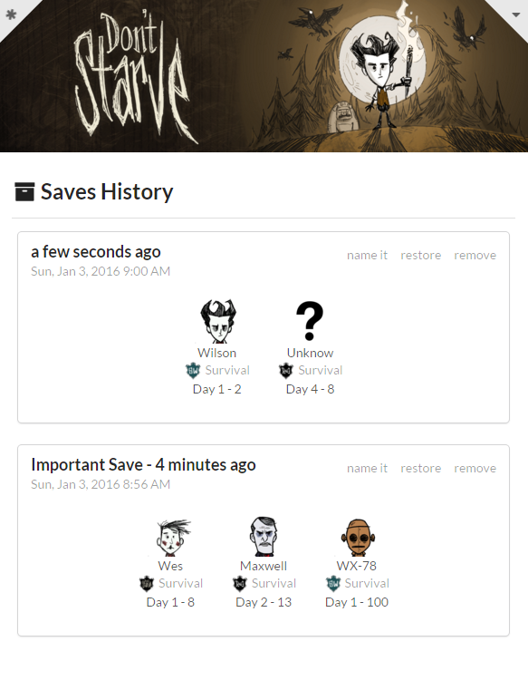

# Don't Lost The Save
> Your essential utility tool to avoid the time lost when you die and to accelerate your learning curve of the game. It's backup automatically the saves of the game, and provide detailed information about the Slots, and Character being played. (for Windows only, for now...)

## Instalation

* Download the [Installer](https://s3-sa-east-1.amazonaws.com/releases.conradoqg.eti.br/dontlostthesave/dontlostthesaveSetup0.0.1.exe) (or the [Standalone](https://s3-sa-east-1.amazonaws.com/releases.conradoqg.eti.br/dontlostthesave/dontlostthesaveStandalone0.0.1.zip));
* Follow the setup instructions;
* Start the app;
* Search the Don't Starve directory and select the place to save the backup;
* Enjoy ;)

## Features

* Automatic backup of the saves;
* Naming, to you find your most valuable saves;
* Restore button to make your life easy;

## Development

This app is made using:
* Node
* Electron
* React
* Gulp

### Installation

    $ git clone git@gitlab.com:conradoqg/dontlostthesave.git
    $ npm install
    $ npm install -g electron-prebuilt
    $ npm install -g gulp

### Running

    # Run the gulp default task (compile and watch)
    $ npm dev

    # Run the electron app
    $ npm start

#### Tasks

    $ gulp <task>

The important ones are:
* Default - Compile and watch the sources (to recompile when need). When you modify a main .js file, you need to restart the app;
* Help - Details the avaliable tasks;
* Dist - Compiles, Builds, and generate the Dist version, containing the electron app and the installer. (Requires NSIS installed)

### Contribution

Looking for contributors to extend this app to Linux and MacOS.

#### Issues

When you find issues, please report them:

WEB: [https://gitlab.com/conradoqg/dontlostthesave/issues](https://gitlab.com/conradoqg/dontlostthesave/issues)

### Contribution and License Agreement

If you contribute code to this project, you are implicitly allowing your code
to be distributed under the MIT license. You are also implicitly verifying that
all code is your original work.

## License

Copyright (c) 2016-2016, Conrado Quilles Gomes. (MIT License)

See LICENSE for more info.